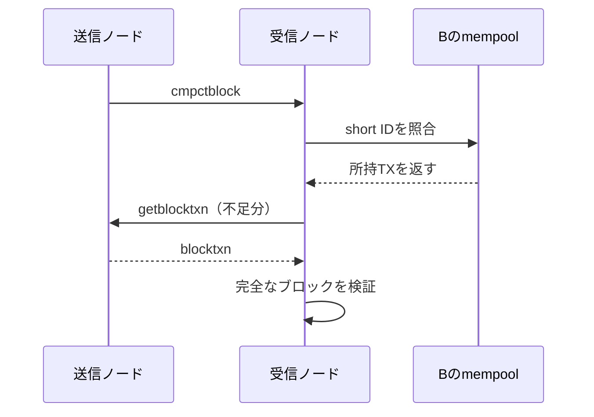

## はじめに

Bitcoinのフルノードは、新しいブロックを受け取ると別のノードへ中継します。素朴に実装するなら、ブロックヘッダーとブロック内の全トランザクションをそのまま送れば済みます。

しかし、この方法には重複があります。ブロックに入った通常トランザクションの多くは、ブロックが見つかる前にP2Pネットワークを流れています。受信ノードのmempoolにも、同じトランザクションがすでにある可能性が高いのです。

BIP152で定義された**Compact Block Relay**は、この重複を利用します。送信側はブロック全体を最初から送らず、受信側が持っているトランザクションを再利用できるように、短い識別子を中心とした「ブロックの組み立て情報」を送ります。

この記事では、Compact Block Relayのメッセージ構造からBitcoin Coreにおける復元処理までを追います。

## 先に結論

Compact Block Relayの要点は、次のとおりです。

- 通常のブロック送信は、ブロック内の全トランザクション本体を送ります
- Compact Block Relayは、受信側のmempoolにあるトランザクションを再利用します
- 最初の`cmpctblock`には、ブロックヘッダー、nonce、6バイトのshort ID群、coinbaseなど一部の完全なトランザクションが入ります
- 受信側にないトランザクションだけを、`getblocktxn`と`blocktxn`で追加取得します
- Compact Blockは検証を省略しません。復元後は通常のブロックとして完全に検証します
- 通信量を抑えるだけでなく、実用上はブロック伝播の遅延を短くし、stale blockが生じるリスクを下げる効果があります

つまり、Compact Blockは「一部のトランザクションだけでブロックを検証する仕組み」ではありません。「相手がすでに持つデータをもう一度送らないための転送方式」です。

## なぜブロック全体を再送するのが無駄なのか

通常、未承認トランザクションはブロックに入る前からノード間で中継されます。各ノードは、自身のポリシーを満たした未承認トランザクションをmempoolに保持します。

その後、マイナーが新しいブロックを作ったとします。従来型の送信では、受信ノードがすでに持っているトランザクションも含め、ブロック内の全トランザクション本体を再送します。

```text
通常のブロック送信
  ブロックヘッダー
  coinbaseトランザクション本体
  TX Aの本体  ← 受信側のmempoolにある
  TX Bの本体  ← 受信側のmempoolにある
  TX Cの本体  ← 受信側のmempoolにある
  TX Dの本体  ← 受信側にはない
```

受信側がA、B、Cをすでに持っているなら、本当に追加で必要なのはDだけです。Compact Block Relayは、A、B、Cについて短い識別子を送り、受信側に手元のトランザクションを当てはめてもらいます。

この最適化が有効なのは、送信側と受信側のmempoolが完全に同じだからではありません。**かなりの部分が重なっている**だけで十分です。差分があれば、後からその差分だけを取得できます。

## Compact Block Relayの全体像

Compact Block Relayでは、接続時に`sendcmpct`メッセージを交換し、対応するCompact Blockのバージョンと通知方法を調整します。新しいブロックの転送には、主に次のメッセージを使います。

| メッセージ | 役割 |
| --- | --- |
| `sendcmpct` | Compact Blockのバージョンと通知モードを伝える |
| `cmpctblock` | ヘッダー、short ID、事前送信する完全なTXを送る |
| `getblocktxn` | 復元に足りない位置のTXを要求する |
| `blocktxn` | 要求された完全なTXを返す |

典型的な流れは次のようになります。



すべてのトランザクションが手元にあれば、`getblocktxn`以降は不要です。この場合、受信側は`cmpctblock`だけで完全なブロックを復元できます。

## `cmpctblock`に含まれる情報

`cmpctblock`は、BIP152の`HeaderAndShortIDs`構造をシリアライズしたメッセージです。主に次の情報を含みます。

| フィールド | 内容 |
| --- | --- |
| `header` | 80バイトのブロックヘッダー |
| `nonce` | short ID用のキーを導出する64ビット値 |
| `shortids` | 完全な形では送らないTXの6バイト識別子 |
| `prefilledtxn` | 位置情報と完全なTXの組 |

`prefilledtxn`には、受信側が持っていないと送信側が予想するトランザクションを入れられます。coinbaseトランザクションはブロックごとに新しく作られるため、通常は受信側のmempoolにありません。そのため、少なくともcoinbaseを完全な形で含めるのが基本です。

Bitcoin Coreの`CBlockHeaderAndShortTxIDs`も、現在は先頭のcoinbaseを`prefilledtxn`へ置き、それ以外をshort IDにしています。BIP152は追加のトランザクションを事前送信する余地も定義しています。

`prefilledtxn`の位置は差分符号化されています。これは、複数の位置を小さな整数で効率よく表現するためです。受信側は位置を復号し、coinbaseなどをブロック内の正しい場所へ配置します。

## short transaction IDの仕組み

txidやwtxidは256ビット、つまり32バイトです。それを全トランザクション分並べるだけでも無視できないサイズになります。そこでBIP152は、各トランザクションを**6バイト（48ビット）のshort transaction ID**で表します。

概念的には次の計算です。

```text
key_material = SHA256(block_header || nonce)
k0, k1       = key_materialの先頭側から取り出した2つの64ビット値
short_id     = SipHash-2-4(k0, k1, transaction_hash) の下位48ビット
```

より短く書けば、次のように捉えられます。

```text
short_id = SipHash(key, transaction_hash) の下位48ビット
```

ここで使う`transaction_hash`は、Compact Blockのバージョンによって異なります。

- バージョン1はtxidを使います
- SegWitに対応したバージョン2はwtxidを使います

現在のBitcoin Core実装は、`GetWitnessHash()`で得たwtxidからshort IDを計算します。

### キーは「接続固有」とは限らない

ブロックヘッダーとnonceからキーを変えることで、固定の短縮IDをネットワーク全体で使い回さずに済みます。ただし、キーを厳密に「接続ごと」と説明するのは正確ではありません。

BIP152では、送信ノードが1ブロックにつき1つのnonceを選び、同じ`cmpctblock`を複数のピアへ再利用することも認めています。したがってキーは、**そのCompact Block表現に結び付いた一時的なキー**と考えるのが適切です。異なるブロックで同じnonceを使い回すことは推奨されません。

### short IDは証明ではない

48ビットしかないshort IDは、トランザクションを一意に証明するものではありません。異なるトランザクションが同じshort IDになる可能性があります。

SipHashを使う目的は、攻撃者が都合のよい衝突を大量に事前計算しにくくすることです。それでもshort IDはあくまで照合の手掛かりです。安全性は、復元された完全なブロックに対する通常の検証によって保証されます。

## 受信側がmempoolからブロックを復元する流れ

受信側は、`cmpctblock`を受け取ると次の処理を行います。

```text
cmpctblockを受信
  ↓
ヘッダーとprefilled transactionを確認
  ↓
short IDをmempool内のトランザクションと照合
  ↓
ブロック内の対応する位置にトランザクションを配置
  ↓
不足分をgetblocktxnで要求
  ↓
blocktxnで不足TXを受信
  ↓
完全なブロックとして検証
```

Bitcoin Coreでは、この途中状態を`PartiallyDownloadedBlock`が管理します。`InitData()`は`cmpctblock`のshort IDを索引化し、mempool内のwtxidから同じshort IDを計算して候補を探します。見つかったTXは対応位置へ置かれ、空いた位置が不足分になります。

mempool以外にも、最近受信したがmempoolには残らなかったトランザクションなど、実装が保持する追加候補が復元に使われる場合があります。基本原理は同じで、ローカルにある完全なTXをshort IDで対応付けます。

## トランザクションが不足している場合

送受信ノードのmempoolは完全には一致しません。不足が起きる主な理由は次のとおりです。

- トランザクションが受信ノードへまだ届いていない
- ノードごとのmempool policyが異なり、受信側では受理されなかった
- mempoolの容量制限や手数料率によりevictされた
- トランザクションが公開P2Pネットワークを通らず、マイナーへ直接送られた
- 親トランザクションが不足するなどの理由で、受信側が保持していない

これは異常ではありません。Compact Block Relayはmempoolの一致を前提にせず、欠けているTXを追加取得するプロトコルを最初から備えています。

差分が大きすぎる場合や復元処理が失敗した場合、実装は通常形式の完全なブロック取得へフォールバックできます。Compact Blockだけで何としても復元しなければならないわけではありません。

## `getblocktxn`と`blocktxn`

受信側は、復元できなかったトランザクションの**ブロック内インデックス**を`getblocktxn`で要求します。要求には対象ブロックのハッシュと、不足位置の一覧が入ります。インデックス一覧も通信量を抑えるため差分符号化されます。

送信側は、その位置にある完全なトランザクションを同じ順序で`blocktxn`に入れて返します。

```text
B → A: getblocktxn
       block hash = H
       missing indexes = [4, 19, 25]

A → B: blocktxn
       block hash = H
       transactions = [TX at 4, TX at 19, TX at 25]
```

受信側は受け取ったTXを空いていた位置へ入れます。これでブロック内の全トランザクションが揃い、通常の検証処理へ渡せます。

BIP152では、送信側が対象データを提供できない場合、完全な`block`メッセージを返す経路も定義されています。Bitcoin Coreも、古いブロックなどCompact Blockで扱わない条件では通常ブロックを使います。

## short IDが衝突した場合

48ビットのshort IDには、偶然の衝突可能性があります。衝突には大きく2種類あります。

1. `cmpctblock`内の複数TXが同じshort IDになる
2. 受信側の複数候補が同じshort IDに一致する

候補が一意に決まらなければ、受信側はそのshort IDだけを信用してTXを選びません。Bitcoin Coreでは、mempool内で2つ目の候補が一致すると、その位置を未取得へ戻して完全なTXを要求します。`cmpctblock`内のshort ID自体が重複している場合も、復元失敗として扱います。

仮に誤った候補を一度配置しても、Merkle rootやwitness commitmentとの不一致を含む後続の検査で検出されます。必要なら完全なブロックを取得し直せます。

:::message alert
short IDの衝突によって、不正なブロックが有効になることはありません。short IDは転送時の候補検索にしか使われず、コンセンサス上の識別子ではありません。
:::

## High-bandwidth modeとLow-bandwidth mode

BIP152には、Compact Blockをいつ送るかが異なる2つのモードがあります。モードは`sendcmpct`の最初の値で相手に希望を伝えます。

### High-bandwidth mode

High-bandwidth modeでは、新しいブロックを受け取ったノードが、相手からの個別要求を待たずに`cmpctblock`を送ります。

```text
A → B: cmpctblock
B → A: getblocktxn（不足がある場合のみ）
A → B: blocktxn
```

事前の`inv`と`getdata`の往復を省けるため、ブロック伝播遅延を減らせます。さらにBIP152は、ヘッダー、Proof of Work、直前の検証済みチェーンへの接続、トランザクションへのコミットなどを確認した後なら、各TXのUTXOに対する完全な検証が終わる前に`cmpctblock`を中継できる設計です。もちろん、最終的にブロックを採用するまでには完全な検証が必要です。

一方、複数ピアが同時に同じブロックを送ると重複通信が増えます。そのため、すべてのピアをHigh-bandwidthにするものではありません。BIP152は、受信帯域に余裕があるノードでもHigh-bandwidthを要求する相手を最大3ピアに制限するよう定めています。実装は高速にブロックを届けるピアを限って選びます。

### Low-bandwidth mode

Low-bandwidth modeでは、送信側は従来どおり`inv`または`headers`で新しいブロックを通知します。受信側が必要だと判断した場合、`getdata`で`MSG_CMPCT_BLOCK`を要求し、送信側が`cmpctblock`を返します。

```text
A → B: inv または headers
B → A: getdata(MSG_CMPCT_BLOCK)
A → B: cmpctblock
B → A: getblocktxn（不足がある場合）
A → B: blocktxn
```

High-bandwidth modeより往復回数は増えます。しかし、受信側がすでに別のピアから同じブロックを取得していれば要求しないため、不要な重複送信を避けられます。

両モードは、速度と重複通信のトレードオフです。High-bandwidthは限られた高速ピアから早く受け取り、Low-bandwidthはその他のピアとの帯域消費を抑えます。

## mempoolの内容が異なる場合

mempoolはコンセンサスの状態ではありません。各ノードが独自に管理する未承認トランザクションの集合です。容量、最小手数料率、標準性ルール、到着順などによって内容が変わります。

mempoolの重なりが大きければ、`cmpctblock`だけ、または少数の追加TXで復元できます。重なりが小さければ`getblocktxn`で要求する数が増え、Compact Blockの効率は下がります。

それでも正しさは変わりません。受信側は最終的に全トランザクションを揃えます。復元コストが高すぎる場合は、完全なブロックを取得できます。

ここから分かる重要な点は、Compact Block Relayが**共有キャッシュを利用する差分転送**に近いことです。ただしmempoolは同期されたキャッシュではないため、差分取得とフォールバックが欠かせません。

## Compact BlockはSPVではない

Compact Blockという名前から、ブロックの一部だけを検証する方式だと誤解されることがあります。しかし、Compact Block Relayはフルノード間の**転送方式**です。

受信側は最終的にすべてのトランザクションを取得し、完全なブロックを組み立てます。その後、通常どおり少なくとも次の検証を行います。

- ブロックヘッダーとProof of Work
- Merkle rootと、SegWit有効時のwitness commitment
- 各トランザクションの構造
- Scriptと署名
- 入力が参照するUTXOと二重使用の有無
- 手数料、coinbase報酬、block weightなどのコンセンサス規則

SPV（Simplified Payment Verification）のように、ブロックヘッダーとMerkle proofだけで自分に関係するトランザクションを確認する方式ではありません。

:::message
Compact Blockは「検証をcompactにする」のではなく、「転送をcompactにする」仕組みです。
:::

## Compact Block Filtersとの違い

名前が似ている機能にCompact Block Filtersがあります。これはCompact Block Relayとは目的も利用者も異なります。

| 機能 | BIP | 用途 |
| --- | --- | --- |
| Compact Block Relay | BIP152 | フルノード間でブロックを効率よく転送する |
| Compact Block Filters | BIP157/BIP158 | 軽量クライアントが自分に関連するトランザクションを探す |

Compact Block Filtersは、ブロック内のScriptに関する圧縮フィルターをフルノードが提供し、軽量クライアントが関係しそうなブロックを判断する仕組みです。受信側のmempoolを使ってブロックを復元するBIP152とは別物です。

## ブロック伝播が速くなることの意味

新しいブロックが見つかってからネットワーク全体へ行き渡るまでには時間がかかります。その間も、まだ新しいブロックを知らないマイナーは古い先端の上で採掘を続けます。

ほぼ同時に別の有効ブロックが見つかると、一時的にチェーンの先端が分岐します。最終的により多くのworkが積まれなかった側のブロックはstale blockとなり、そのブロックを掘ったハッシュパワーは最長チェーンの成長に寄与しません。

伝播遅延が短くなれば、各マイナーが新しい先端へ切り替えるまでの時間も短くなります。その結果、競合ブロックが生まれる時間窓を狭められます。

これは単なる快適さの問題ではありません。伝播に時間がかかる環境では、高速な専用ネットワークを持つ大規模マイナーが相対的に有利になります。一般のP2Pネットワークでもブロックを速く中継できることは、stale blockの発生率を抑え、マイニングの地理的・運用的な条件差を小さくする助けになります。

なお、BIP152が掲げた直接の目的は帯域使用量の削減であり、遅延短縮はその設計から得られる重要な効果です。High-bandwidth modeは、その効果を積極的に利用して通知の往復も減らします。

## まとめ

Compact Block Relayは、ブロックに含まれるトランザクションの多くを受信ノードがすでに持っている、という現実を利用します。

- `cmpctblock`はヘッダー、nonce、short ID、coinbaseなどの完全なTXを送ります
- short IDはSipHashを使った6バイトの識別子です
- バージョン1はtxid、SegWit対応のバージョン2はwtxidを入力に使います
- 受信側はmempoolなどのローカルTXからブロックを組み立てます
- 不足分は`getblocktxn`で要求し、`blocktxn`で受け取ります
- 衝突や曖昧な候補があれば、short IDを信用せず完全なTXを取得します
- High-bandwidth modeは通知待ちを省いて遅延を減らします
- Low-bandwidth modeは要求された場合だけ送り、重複通信を抑えます
- 復元後はMerkle root、Script、署名、UTXO、block weightなどを通常どおり検証します

「ブロック全体を送らない」とは、「ブロック全体を確認しない」という意味ではありません。すでに一度ネットワークを流れたデータを再利用し、同じ完全なブロックへ効率よく到達する。それがBIP152の中心的なアイデアです。

## 参考資料

- [BIP152: Compact Block Relay](https://github.com/bitcoin/bips/blob/master/bip-0152.mediawiki)（2026-06-22確認）
- [Bitcoin Core: `src/blockencodings.h`](https://github.com/bitcoin/bitcoin/blob/master/src/blockencodings.h)（2026-06-22確認）
- [Bitcoin Core: `src/blockencodings.cpp`](https://github.com/bitcoin/bitcoin/blob/master/src/blockencodings.cpp)（2026-06-22確認）
- [Bitcoin Core: `src/net_processing.cpp`](https://github.com/bitcoin/bitcoin/blob/master/src/net_processing.cpp)（2026-06-22確認）
- [Bitcoin Core: Compact Blocks FAQ](https://bitcoincore.org/en/2016/06/07/compact-blocks-faq/)（2026-06-22確認）
- [BIP157: Client Side Block Filtering](https://github.com/bitcoin/bips/blob/master/bip-0157.mediawiki)（2026-06-22確認）
- [BIP158: Compact Block Filters for Light Clients](https://github.com/bitcoin/bips/blob/master/bip-0158.mediawiki)（2026-06-22確認）

## 更新履歴

- 2026-06-22: 初版
