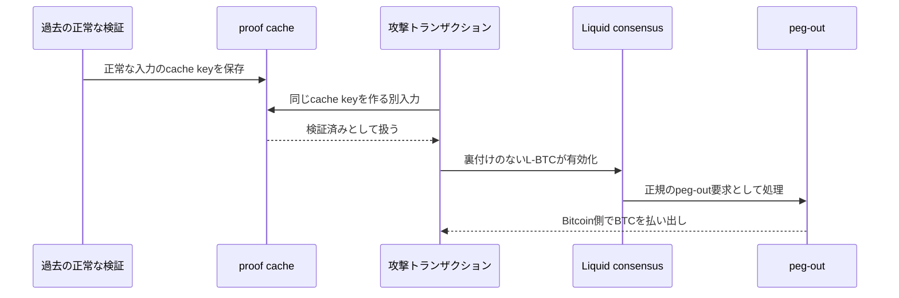

## はじめに

2026年9月6日、BitcoinのサイドチェーンであるLiquid Networkで、裏付けのない約4,000 L-BTCが生成され、約4,000 BTCがBitcoin側へ払い出されるインシデントが発生しました。

秘密鍵が盗まれて署名を偽造された事件ではありません。原因は、Elementsが高価な暗号学的検証の結果を再利用するために使っていた**rangeproof検証キャッシュ**でした。

キャッシュ自体は一般的な高速化手法です。しかし、キャッシュキーが「何を検証したか」を一意に表していなければ、異なる入力に対して過去の検証結果を誤って再利用します。コンセンサス処理でそれが起きると、本来は無効なトランザクションを有効と判断しかねません。

この記事では、Blockstreamが2026年9月23日に公開した事後報告をもとに、次の順序で事故を整理します。

- LiquidにおけるL-BTCとpeg-outの仕組み
- Confidential Transactionsとrangeproofの役割
- 2018年から存在したBug A
- Bug Aの修正が作ったBug B
- なぜ正規のpeg-out処理が流出を止められなかったのか
- 修正とチェーン復旧から得られる教訓

:::message alert
この記事は2026年9月28日時点の公開情報に基づきます。資金回収や調査の状況は、公開後に変わる可能性があります。
:::

## 先に結論

今回の要点は次のとおりです。

- Liquidでは、Bitcoin上でロックされたBTCと同量のL-BTCをサイドチェーン上で扱います
- Confidential Transactionsでは金額を秘匿しながら、その値が有効な範囲にあることをrangeproofで証明します
- Elementsは高価なproof検証を繰り返さないため、検証結果をキャッシュしていました
- 2018年に導入されたBug Aでは、cache keyに`asset commitment`と`scriptPubKey`が含まれていませんでした
- 2026年8月の修正では不足フィールドを追加しましたが、長さ情報なしでバイト列を単純結合したため、別の入力でも同じ連結結果を作れるBug Bが生じました
- 攻撃トランザクションは、以前に正常に検証されたproofと同じcache keyを作り、本来失敗する検証を成功済みとして扱わせました
- その結果、裏付けのない約4,000 L-BTCが有効な残高として認識され、正規のpeg-out処理から約4,000 BTCが払い出されました
- 修正版では、各フィールドを長さ付きでシリアライズしてからcache keyを計算します

重要なのは、単なる「ハッシュ衝突」ではない点です。SHA-256そのものが破られたわけではありません。**複数フィールドを区切りなく連結したため、異なるフィールド列が同じ入力バイト列になった**ことが問題でした。

## LiquidとL-BTC

Liquidは、ElementsをベースにしたBitcoinのフェデレーション型サイドチェーンです。Blockstreamの報告によると、15台のfunctionary nodeで運用され、ブロックの承認には15台中11台の署名が必要です。

Liquid上では、BitcoinをL-BTCとして扱います。概念的には次の関係です。

```text
Bitcoin側で1 BTCをロック
  ↓ peg-in
Liquid側で1 L-BTCを利用

Liquid側で1 L-BTCをburn
  ↓ peg-out
Bitcoin側で1 BTCを払い出し
```

この仕組みが安全であるには、少なくとも次の条件が必要です。

```text
Liquid上のL-BTC総量
  ≦
Bitcoin上でロックされた準備金
```

Liquidのコンセンサスが、裏付けのないL-BTCを作れないことを保証し、その状態を前提にpeg-outが実行されます。

Blockstreamの事後報告では、peg-out時に別系統の準備金監査がトランザクションごとに行われるわけではなく、サイドチェーン上で有効と判断された状態に依存すると説明されています。したがって、Liquidのコンセンサスが裏付けのないL-BTCを有効と認識すると、その後の正規処理だけでは偽物と本物を区別できません。

## Confidential Transactionsとrangeproof

LiquidはConfidential Transactionsを使用し、トランザクションの金額とasset typeを秘匿します。

通常のBitcoinトランザクションでは、各outputの金額をノードが直接読めます。入力金額と出力金額を比較すれば、勝手な新規発行がないことを確認できます。

金額を秘匿する場合、ノードには値そのものではなく、値への**commitment**が見えます。

```text
公開されるもの: value commitment
秘匿されるもの: 実際の金額、blinding factor
```

ただしcommitmentだけでは、その中身が許可された範囲の値か分かりません。そこでrangeproofを添え、秘匿した値が有効な範囲内にあることを、金額を明かさずに証明します。

Liquidでは、proofの意味はrangeproof単体だけで決まりません。事後報告によると、少なくとも次の入力との組み合わせが重要です。

- rangeproof
- value commitment
- asset commitment
- `scriptPubKey`

同じproofのバイト列であっても、異なるasset commitmentや`scriptPubKey`に結び付ければ、同じ検証対象ではありません。

## なぜ検証結果をキャッシュするのか

暗号学的proofの検証には計算コストがかかります。同じトランザクションがmempool検証とブロック検証で繰り返し現れるたびに、同じproofを最初から検証するのは非効率です。

そこでElementsは、検証対象からcache keyを作り、成功した結果を保存していました。

概念的には次の処理です。

```text
key = Hash(検証対象を表すデータ)

if cacheにkeyがある:
    過去に検証済みとして扱う
else:
    proofを実際に検証する
    成功したらkeyをcacheへ保存する
```

この最適化が正しいためには、次の条件が必要です。

```text
cache keyが同じ
  ⇒ 検証結果へ影響する全入力が同じ
```

逆に、異なる検証対象が同じcache keyになるなら、過去の成功結果を無関係な入力に使い回してしまいます。

## Bug A：cache keyに入力が欠けていた

Blockstreamの報告では、問題の原型は2018年4月の変更で導入されました。

rangeproofの検証結果は、proofとvalue commitmentだけでなく、asset commitmentと`scriptPubKey`にも依存します。しかし、Bug Aのcache keyでは後者2つが欠けていました。

概念的には次の状態です。

```text
実際の検証対象:
  proof
  value commitment
  asset commitment
  scriptPubKey

Bug Aのcache key:
  Hash(proof || value commitment)
```

これでは、proofとvalue commitmentが同じであれば、asset commitmentや`scriptPubKey`が異なっていても同じcache entryへ到達します。

この不備は2018年に導入され、2019年のリファクタリング後も残りました。2026年8月に外部研究者から報告され、修正作業が始まりました。

## Bug B：不足フィールドを足しても安全ではなかった

Bug Aへの直接的な修正は、欠けていたフィールドをcache keyへ追加することです。

```text
Hash(
  proof ||
  value commitment ||
  asset commitment ||
  scriptPubKey
)
```

一見すると、必要な入力がすべて入りました。しかし、この修正では各フィールドのバイト列を長さ情報や区切りなしで連結していました。

可変長フィールドを単純連結すると、フィールド境界が一意に決まりません。簡略化した例では、次の2組を区別できません。

```text
入力1: "ab" || "c"  = "abc"
入力2: "a"  || "bc" = "abc"
```

この2つは論理的には別のフィールド列ですが、ハッシュ関数へ渡るバイト列は同じです。したがって、ハッシュ関数に衝突を探させる必要すらありません。

今回の修正で生じたBug Bも、この**フィールド境界の曖昧性**を利用するものでした。攻撃者は、過去に正しく検証されてcacheへ入ったデータと、連結後のバイト列が同じになる別の入力を構成しました。

```text
正常な入力の連結バイト列
  =
攻撃入力の連結バイト列

したがって

SHA256(正常な入力の連結バイト列)
  =
SHA256(攻撃入力の連結バイト列)
```

これはSHA-256の暗号学的衝突ではありません。ハッシュに渡す前から同じバイト列です。

## 攻撃はどのように成立したのか

事故の流れを単純化すると、次のようになります。



攻撃トランザクションは2026年9月6日13:53 UTC、Liquid block 4,050,336で承認されました。そこでは、入力に裏付けられていないconfidential outputが作られていました。

本来のrangeproof検証を実行すれば失敗します。しかし、攻撃を受けたノードのcacheに対応する過去のentryがあると、実際のproof検証を行わず、成功済みとして扱いました。

その結果、約4,000の裏付けのないL-BTCが、Liquidの有効なchain stateへ入りました。

## なぜすべてのノードが同じ結果にならなかったのか

Blockstreamの報告によると、当時の15台のfunctionaryは同じ修正版を動かしていました。それでも、各ノードが同じトランザクションを同じように扱うとは限りませんでした。

Bug Bで誤った成功結果が返るには、ノードのcacheに、衝突対象となる過去のentryが入っている必要があります。

```text
該当entryがcacheにあるノード
  → proof本体を再検証せずaccept

該当entryがcacheにないノード
  → proof本体を検証してreject
```

つまり、同じソフトウェアでも、実行時のcache内容によって検証結果が分かれます。これはコンセンサスソフトウェアにおいて深刻な性質です。

## なぜPAKは流出を止められなかったのか

今回のpeg-outは、Liquid FederationメンバーであるSideSwapが持つPeg-out Authorization Key（PAK）の経路を通りました。

ここで「PAKが盗まれた」と考えると、事故の本質を見誤ります。Blockstreamの報告では、SideSwapのPAKは侵害、偽造、窃取されていません。

問題は、PAKが認証した対象です。

```text
Liquid consensus:
  このL-BTCは有効である、と誤認

PAK:
  有効とされたL-BTCについて、登録済み経路へのpeg-outを認証
```

PAKは、Liquidのコンセンサスが認めたL-BTCが本当にBTCで裏付けられているかを、独立に再検証する仕組みではありません。そのため、上流のコンセンサス検証が壊れると、下流の認証が正常でも不正な払い出しを止められませんでした。

## 被害と対応

Blockstreamの事後報告に記載された主な数値は次のとおりです。

| 項目 | 数値 |
| --- | ---: |
| 不正に生成されたL-BTC | 約4,000 L-BTC |
| Bitcoin側へ払い出された額 | 約4,000 BTC |
| インシデント前のLiquid準備金 | 約4,205 BTC |
| 一時的に残った準備金 | 約197 BTC |
| 攻撃者が返還した額 | 3,400 BTC |
| 2026年9月17日時点の未回収額 | 約602 BTC |

Liquidはbridge nodeを停止し、ネットワークを一時停止しました。その後、緊急パッチとElements v23.3.4を公開しています。

不正状態からの復旧では、rangeproof cacheを無効にして対象チェーンを再検証しました。キャッシュを使わなければ不正proofは失敗するため、無効なトランザクションとその子孫を識別できます。

Liquidは、問題のblock 4,050,336以降を修正したチェーンへ再編成し、独立実装の`rust-elements`でも結果を照合したと報告しています。

## 修正：曖昧でないシリアライズ

Elements PR #1600とcommit `9400096`では、rangeproofとsurjection proofのcache key計算を、単純なraw byteの連結から`CHashWriter`によるシリアライズへ変更しました。

概念的には、次の違いです。

```text
修正前:
  Hash(A || B || C || D)

修正後:
  Hash(
    len(A) || A ||
    len(B) || B ||
    len(C) || C ||
    len(D) || D
  )
```

各フィールドの長さが明示されれば、どこまでがAで、どこからがBかを一意に復元できます。

修正版では固定長のフィールドも含め、すべてを明示的な長さ付き形式で扱います。将来フィールドの長さや検証条件が変わった場合にも、境界の曖昧性が再発しにくくなります。

また、運用者がrangeproof cacheを完全に無効化できる`-norangeproofcache`オプションも追加されました。

## この事故から分かること

### キャッシュキーはコンセンサス処理の一部である

キャッシュは「ただの高速化」に見えます。しかし、キャッシュヒット時に本来の検証を省略するなら、cache keyの定義は検証ロジックそのものです。

```text
同じkeyなら、必ず同じ検証結果になる
```

この不変条件を満たさないキャッシュは、性能バグではなくコンセンサスバグになります。

### 必要なフィールドを列挙するだけでは足りない

Bug Aは、検証結果に必要なフィールドが欠けていました。Bug Bは、そのフィールドを追加しても、エンコードが曖昧だったために生じました。

安全なcommitmentには、少なくとも次の両方が必要です。

- 検証結果へ影響する全データを含める
- そのデータを曖昧さなくシリアライズする

### 下流の認証は上流の状態を救えない

PAKは正しく動作しましたが、その入力となるLiquid stateが誤っていました。署名やHSMが安全でも、署名対象の意味が壊れていれば資金は守れません。

これはLiquid固有の話に限りません。ブリッジ、サイドチェーン、取引所の出金処理などでも、上流で確定した状態を下流がどこまで独立検証しているかが重要です。

## よくある誤解

### 「SHA-256が衝突した」

違います。異なる論理フィールドを区切りなしで連結したため、ハッシュ前のバイト列が同一になりました。SHA-256の耐衝突性が破られたわけではありません。

### 「PAKの秘密鍵が盗まれた」

Blockstreamの報告では、PAKの侵害や偽造はありません。Liquidが不正なL-BTCを有効と認識した後、正規のPAK経路でpeg-outされました。

### 「Bitcoin本体で4,000 BTCが新規発行された」

違います。Bitcoinのコンセンサスや発行上限が破られたわけではありません。Liquidの準備金としてBitcoin上にロックされていた既存BTCが払い出されました。

### 「15台中11台の署名があれば、内容も必ず正しい」

functionaryの閾値署名は、各ノードの検証ソフトウェアが正しいことを前提にします。同じ実装上の欠陥を複数ノードが共有すれば、ノード数だけでは防げません。

## 制約・未解決点

- 本記事は主にBlockstreamの事後報告に依存しており、当事者報告である点を考慮する必要があります
- 約602 BTCという未回収額は、2026年9月17日時点の情報です
- SideSwapの運用判断については、SideSwap自身の報告との追加照合が必要です
- Bug A、Bug Bの入力を実際のElementsコードとテストベクトルで再現する検証は、この記事では行っていません
- 今後の外部調査で、原因やタイムラインの説明が更新される可能性があります

## まとめ

Liquidのインシデントでは、rangeproof検証結果を再利用するcache keyが検証対象を一意に表していませんでした。

2018年から存在したBug Aは必要なフィールドを欠き、その修正で生じたBug Bはフィールド境界を曖昧にしました。攻撃者はこの曖昧性を利用し、本来失敗するproofを過去に成功したproofと同じcache entryへ結び付けました。

その結果、裏付けのないL-BTCがLiquidの有効なstateへ入り、下流の正規peg-out処理から実BTCが払い出されました。

この事件が示すのは、コンセンサス処理におけるキャッシュが単なる実装詳細ではないことです。**どの入力を、どの形式でcache keyへcommitするかは、検証規則の一部です。**

## 参考資料

- [Liquid Network Security Incident Assessment](https://blog.blockstream.com/liquid-network-security-incident-assessment/)（2026-09-28確認）
- [Elements PR #1600: Use CHashWriter for rangeproof and surjectionproof cache hasher](https://github.com/ElementsProject/elements/pull/1600)（2026-09-28確認）
- [Elements v23.3.4](https://github.com/ElementsProject/elements/releases/tag/elements-23.3.4)（2026-09-28確認）
- [Confidential Transactions](https://elementsproject.org/features/confidential-transactions)（2026-09-28確認）
- [Liquid Federation Member Charter](https://liquid.net/federation-charter)（2026-09-28確認）

## 更新履歴

- 2026-09-28: 初版ドラフト
